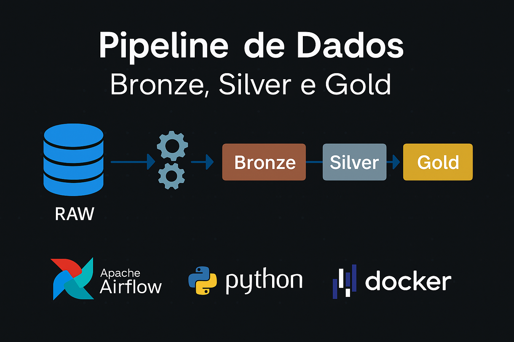
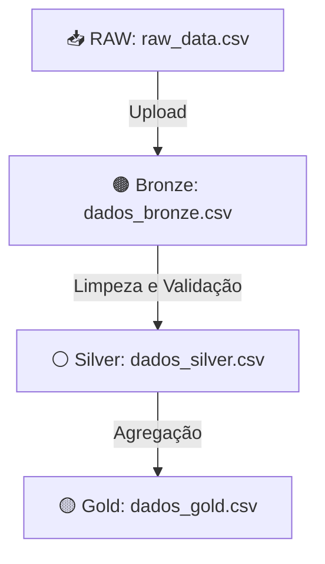

  

## 📌 Visão Geral

Pipeline de dados implementando um fluxo ELT (Extract, Load, Transform) com:
- Extração de dados brutos (RAW)
- Processamento para camada Bronze (dados crus)
- Transformação para camada Silver (dados limpos e tratados)
- Agregações para camada Gold (dados analíticos)

## 📋 Funcionalidades

- `Extração`: Carrega dados CSV para a camada Bronze
- `Transformação Bronze→Silver`:
  - Validação de emails
  - Correção de datas de nascimento
  - Cálculo de idades
- `Transformação Silver→Gold`:
  - Criação de faixas etárias
  - Agregação por status de assinatura

## 🛠 Tecnologias Utilizadas

- **Apache Airflow**: Orquestração do pipeline
- **Pandas**: Processamento de dados
- **Python 3.8+**: Linguagem principal
- **Docker**: Containerização do ambiente

## 🏗 Estrutura do Projeto

- 📁 **AIRFLOW-PROJECT/**
  - 📁 `airflow_home/` - _Configurações do Airflow_
  - 📁 `dags/` - _DAGs do Airflow_
    - 📄 `dag_pipeline_dados.py` - _Pipeline principal_
  - 📁 `data/` - _Camadas de dados_
    - 📁 `raw/` - _Dados brutos_
      - 📄 `raw_data.csv`
    - 📁 `bronze/` - _Dados crus_
      - 📄 `dados_bronze.csv`
    - 📁 `silver/` - _Dados tratados_
      - 📄 `dados_silver.csv`
    - 📁 `gold/` - _Dados analíticos_
      - 📄 `dados_gold.csv`
  - 📁 `logs/` - _Logs de execução_
  - 📄 `docker-compose.yml` - _Configuração do Docker_
  - 📄 `.env` - _Variáveis de ambiente_

## 📊 Diagrama de Fluxo

## ⚙️ Como Executar

## Pré-requisitos:
### - Docker e Docker Compose instalados
### - Python 3.8+

## Clone o repositório
- git clone [[URL_DO_REPOSITÓRIO](https://github.com/lspaulo/RID183469_pipeline_de_dados.git)]

## Navegue até a pasta do projeto
- cd AIRFLOW-PROJECT

## Inicie os containers
- docker-compose up -d

## Acesse o Airflow no navegador
- URL: http://localhost:8080

## Credenciais padrão:
- Usuário: airflow
- Senha: airflow

